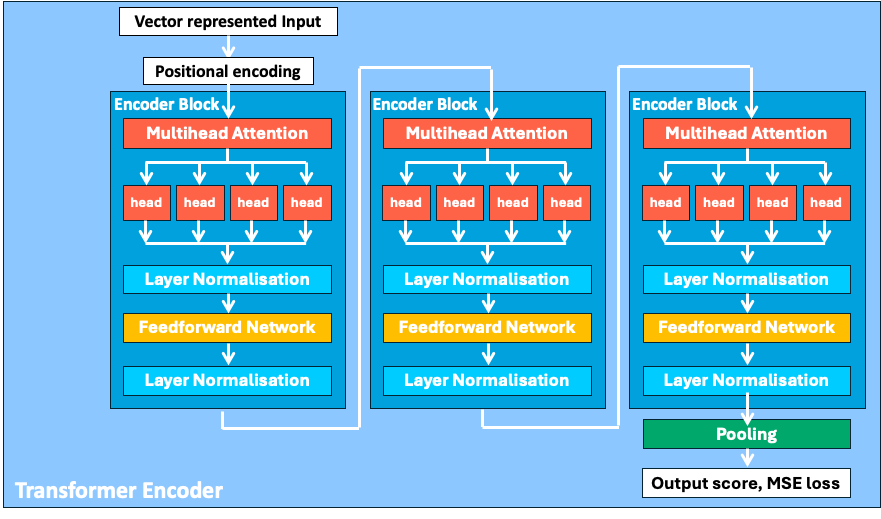
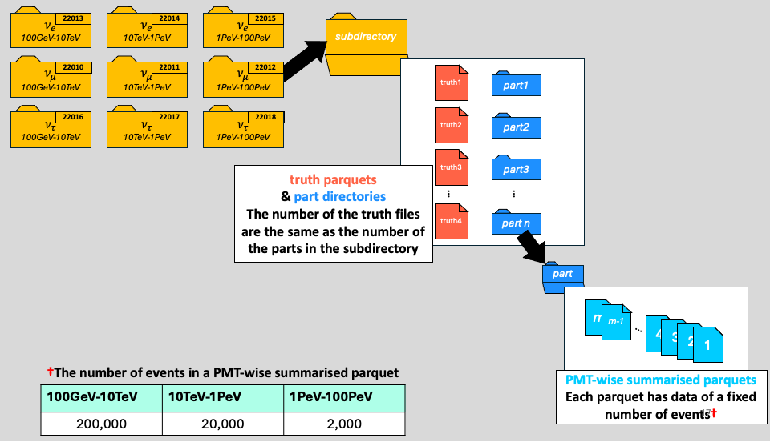

[](LICENSE)  

# Transformer Workshop for Neutrino Flavour Classification
  
This Transformer Encoder model and its data socket are designed to classify the neutrino flavour based on the IceCube Neutrino Observatory data. The data which the model is suited for are DOM-wisely summarised data. The processing of the data is described in [PMTfication github](https://github.com/KUcyans/PMTfication). Thus it requires a characteristic way of storing the data.



## Package Structure
* DataSocket: The package that handles the data input and output. It has Datasets, DataModule and other subsidiary classes for calculating particular aspects or processing the data.
  1. Datasets: There are multiple dataset classes that correspond to the hierarchical data file storage format. 
     1. The unit dataset is [DatasetMonoFlavourShard](https://github.com/KUcyans/IceCubeTransformer/blob/main/DataSocket/DatasetMonoFlavourShard.py) This reads one .parquet file and its corresponding part of the truth file.
     2. [DatasetMultiFlavourShard](https://github.com/KUcyans/IceCubeTransformer/blob/main/DataSocket/DatasetMultiFlavourShard.py) stacks three DatasetMonoFlavourShard as it expects each of them corresponds to a different neutrino flavour.
     3. [DatasetMultiFlavourPart](https://github.com/KUcyans/IceCubeTransformer/blob/main/DataSocket/DatasetMultiFlavourPart.py) collect all the DatasetMultiFlavourShard in a part. If there are remaining shard in any of the part, it will also be collected.
  2. [PMTfiedDataModule](https://github.com/KUcyans/IceCubeTransformer/blob/main/DataSocket/PMTfiedDataModule.py) is a lightning DataModule that wraps the dataset classes.
  3. [PseudoNormaliser](https://github.com/KUcyans/IceCubeTransformer/blob/main/DataSocket/PseudoNormaliser.py) performs batch normalisation on [DatasetMonoFlavourShard](https://github.com/KUcyans/IceCubeTransformer/blob/main/DataSocket/DatasetMonoFlavourShard.py) level. It uses fixed constants to normalise the data instead of calculating statistics from the data.
  4. [EnergyRange](https://github.com/KUcyans/IceCubeTransformer/blob/main/DataSocket/EnergyRange.py) is an enum class that defines the energy range of the neutrinos as well as its corresponding subdirectory name.
  5. [MaxNDOMFinder](https://github.com/KUcyans/IceCubeTransformer/blob/main/DataSocket/MaxNDOMFinder.py) is a class that finds the maximum number of DOMs involved in an event across a shard, part, or a subdirectory. The maximum number of DOMs is used to pad the data to make a dataset. As of 31 January 2025, it must be instantiated separately from the dataset before creating the datamodule. In the future, it would be advisable to integrate the instantiation of MaxNDOMFinder with [DatasetMonoFlavourShard](https://github.com/KUcyans/IceCubeTransformer/blob/main/DataSocket/DatasetMonoFlavourShard.py) for the sake of convenience.
* Model: a package of LEGO blocks to build a transformer model.
  1. [FlavourClassificationTransformerEncoder](https://github.com/KUcyans/IceCubeTransformer/blob/main/Model/FlavourClassificationTransformerEncoder.py) is a prototype transformer encoder model that is designed to classify the neutrino flavour. It wraps multiple encoder blocks and the final classification layer. It  can perhaps be replaced by [TransformerEncoder from PyTorch](https://pytorch.org/docs/stable/generated/torch.nn.TransformerEncoder.html).
  2. [EncoderBlock](https://github.com/KUcyans/IceCubeTransformer/blob/main/Model/EncoderBlock.py)
  3. Building Blocks: contain primitive implementations for the component layers of the transformer model.
     * [InnocentAttention](https://github.com/KUcyans/IceCubeTransformer/blob/main/Model/BuildingBlocks/InnocentAttention.py) is the most basic form of attention layer. The attention mechanism can be divided into multiple head. Each head calculates the attention score between the query and the key. The attention score is then used to weight the value. The weighted value is then summed up to form the output of the attention layer. The output of the attention layer is then passed through a feedforward network. The output of the feedforward network is then passed through a layer normalisation layer. The output of the layer normalisation layer is the output of the attention layer. See[**Attention Is All You Need**](https://arxiv.org/abs/1706.03762)
     * [ALiBiAttention](https://github.com/KUcyans/IceCubeTransformer/blob/main/Model/BuildingBlocks/ALiBiAttention.py) introduces a linear bias to the attention score that carries positional encoding information. $s_{ij} = \frac{q_i \cdot k_j^T}{\sqrt{d_z}} + m_l\cdot(j-i)$. This makes the positional encoding computationally much cheaper and the perflexity for longer input to a low level. See [**Press et al.(2021)**](https://arxiv.org/abs/2108.12409)
     * [ScaledDotProductAttention](https://github.com/KUcyans/IceCubeTransformer/blob/main/Model/BuildingBlocks/ScaledDotProductAttention.py) is an attention layer that uses torch.nn.functional.scale_dot_product_attention
     * [FFN](https://github.com/KUcyans/IceCubeTransformer/blob/main/Model/BuildingBlocks/FFN.py) is a feedforward network layer
     * [LayerNormalisation](https://github.com/KUcyans/IceCubeTransformer/blob/main/Model/BuildingBlocks/LayerNormalisation.py) is a layer normalisation layer. It alleviates the covariate shift problem by normalising the output of the previous layer with statistics calculated from the output of the previous layer. See [**Ba et al.(2016)**](https://arxiv.org/abs/1607.06450)


## New DataSocket `SnowyDataSocket`(2025.02.19)
1. PartDataset: The dataset that reads the data from the part directory. It returns a tensor of shape `(event_length, feature_dim)`.
2. MultiPartDataset: reads data from multiple part directories and retrieves data from different PartDataset instances in a cyclic manner. This ensures that each dataset is accessed sequentially in a loop, distributing indices evenly across all datasets.

---

---

#### **`__getitem__`**
```python
def __getitem__(self, idx):
    idx = int(idx)
    dataset_idx = idx % len(self.datasets)  # ✅ Cycle over datasets sequentially
    
    # ✅ Calculate where this index would land within the combined datasets using searchsorted
    adjusted_idx = idx // len(self.datasets)  # ✅ Distribute indices evenly
    local_idx = adjusted_idx if dataset_idx == 0 else adjusted_idx - self.cumulative_lengths[dataset_idx - 1]

    # ✅ Ensure index wraps around if it's out of range (for smaller datasets)
    local_idx = local_idx % len(self.datasets[dataset_idx])

    return self.datasets[dataset_idx][local_idx]
```

* `dataset_idx`:  
  * Represents the index of the dataset that contains the event.  
  * Determined using modulo operation `idx % len(self.datasets)` to cycle through datasets sequentially.

* `adjusted_idx`:  
  * Distributes indices evenly across datasets using `idx // len(self.datasets)`.

* `local_idx`:  
  * Local index within the selected dataset.  
  * Ensures that the index wraps around if it exceeds the dataset's length using modulo operation.

---

##### **Example**
```python
self.cumulative_lengths = [100, 200, 300]
idx = 150

dataset_idx = idx % len(self.datasets)  # Returns 0, 1, or 2 based on cycling through datasets
adjusted_idx = idx // len(self.datasets)  # Integer division for even distribution
local_idx = adjusted_idx if dataset_idx == 0 else adjusted_idx - self.cumulative_lengths[dataset_idx - 1]
local_idx = local_idx % len(self.datasets[dataset_idx])  # Wraps around if out of range
```
* Explanation:
  ```python
  if idx < 100:
      dataset_idx = 0
  elif idx < 200:
      dataset_idx = 1
  else:
      dataset_idx = 2
  ```
* The dataset at index **1** is selected, and the local index within that dataset is **50**.  
* The index wraps around if it exceeds the dataset's length, ensuring efficient sampling.

---

## Transformer Encoder structure


* TODO
  * consider moving the optimiser to the datamodule from the model
    * training script needs to be changed
  * The model description