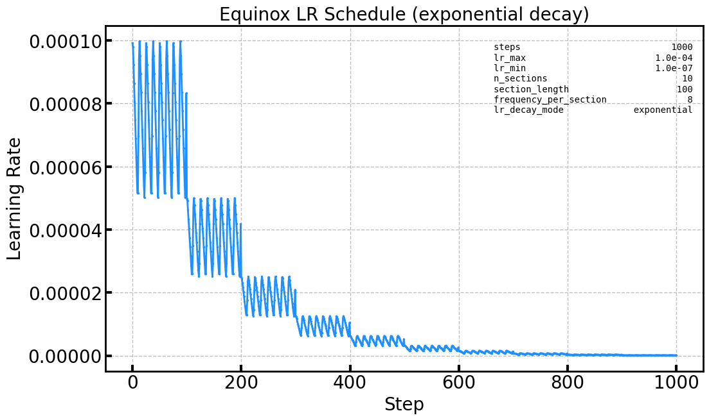

# 2025.03.20 Equinox Decaying Asymmetric Sinusoidal LR Scheduler
I happend to find that a constant learning rate at the beginning of the training actually does a good job. So I chose to find a scheduler with a mild lr variation at the beginning but with some periodic oscillation around the primary lr component value. I found a customised version of CosineAnnealingWarmupRestart on a github repo but it did not not have gentle lr variation at the beginning. So I decided to implement my own scheduler. So I chose to implement my own scheduler.
1. [`EquinoxDecayingAsymmetricSinusoidalLRScheduler`](https://github.com/KUcyans/IceCubeTransformer/blob/main/TrainingUtils/EquinoxDecayingAsymmetricSinusoidal.py)
    * a learning rate scheduler which decays with transient asymmetric sinusoidal oscillations
      * the unit oscillation component is calculated by 
      $$S_n(x) = \sum_{k=1}^{n} \frac{\binom{2n}{n-k}}{\binom{2n}{n} \cdot k} \sin(kx)$$
      * the first peak to peak for `n=10` case will be used as the core of the scheduler - the blue curve in the figure below
      
    * the overall profile is divided into phases whose value is determined by `n_sections`
    * incorporating with `n_sections`, and `total_steps`, member functions will calculate the ceiling, floor, and amplitude at each phase
    
    
    * `frequency_per_section` will decide the frequency of the sinusoidal oscillation within each phase
  
  
  
    * there are different decay modes, each of which has a different way of calculating the ceiling, the floor and the amplitude. See [`LrDecayMode.py`](https://github.com/KUcyans/IceCubeTransformer/blob/main/Enum/LrDecayMode.py)
        1. `linear` decay: the ceiling lr value diminishes by `(min(self.n_sections/10, 0.9)` at each phase  
        
        2. `exponential` decay: logarithm of the storey height(`ceiling - floor`) of each phase is constant, hence the exponential decay
        
        3. `cosine` decay: the logarithm of the storey height passed to $(\frac{1 + cos(\frac{\pi x}{4n_{section}})}{2})$ to redefine ceiling, floor, and amplitude
        

1. [`KaturaCosineAnnealingWarmupRestarts`](https://github.com/katsura-jp/pytorch-cosine-annealing-with-warmup/blob/master/cosine_annealing_warmup/scheduler.py)

2. 